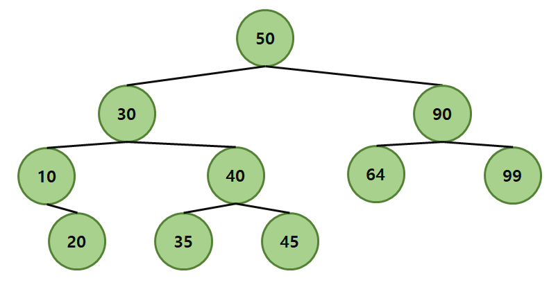
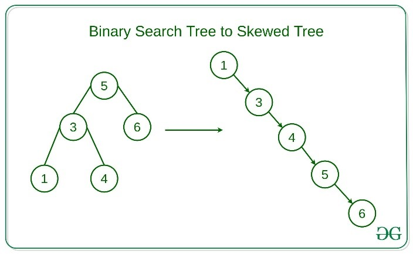
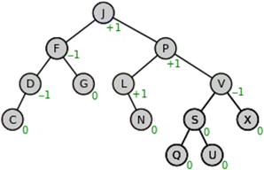
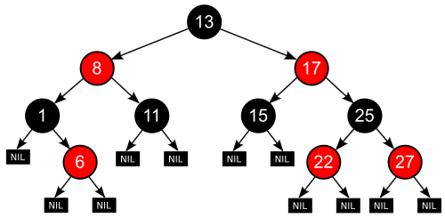
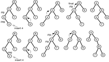
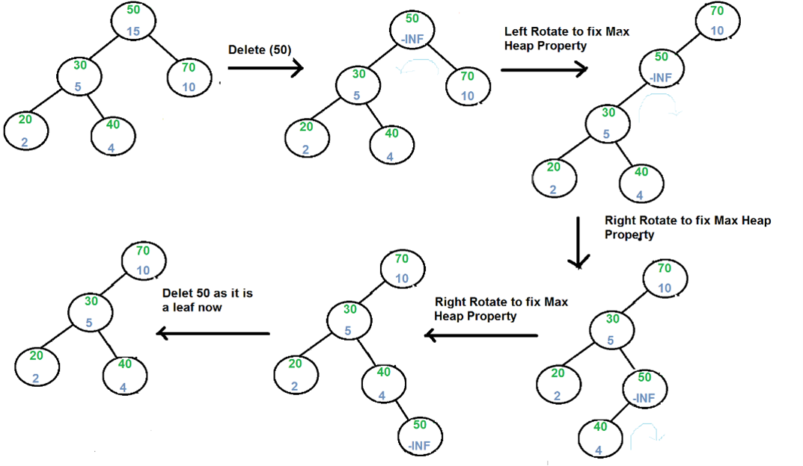
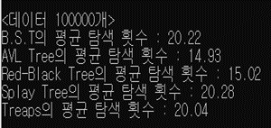
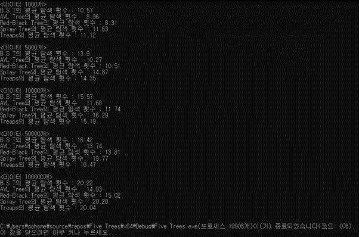

# ⚜5가지 이진탐색트리

</img>

  

#### 이 폴더에서는 이진탐색트리에 대해서 다룹니다. 그리고 여러 균형이진탐색트리 중 AVL tree / Red-Black tree / Splay tree / Treap에 대해 구현 및 설명합니다.

-------------------------------

## 목차
* [1. 저자](#1-저자)
* [2. 언어](#2-언어)
* [3. 소개](#3-소개)
* [4. 알고리즘 종류 및 아이디어](#4-알고리즘-종류-및-아이디어)
  * [4.1 BST](#41-BST)
  * [4.2 AVL Tree](#42-AVL-Tree)
  * [4.3 Red Black Tree](#43-Red-Black-Tree)
  * [4.4 Splay Tree](#44-Splay-Tree)
  * [4.5 Treap](#45-Treap)
* [5. 테스트 결과 및 분석](#5-테스트-결과-및-분석)
* [6. 결론](#6-결론)
* [7. 실행화면](#7-실행화면)

## 1. 저자
* #### 이한범  

## 2. 언어
* C++  

## 3. 소개

> Heap에서는 상/하에 따른 우선순위가 결정되었다. 좌/우에서의 우선순위가 절대적이지 않았고, 힙을 구성하고 전체적으로 힙을 재정비하는 시간에 O(nlgn)의 시간이 걸린다. 이와 달리, B.S.T에서는 왼쪽의 값이 오른쪽의 값보다 작다. 상/하에서의 값은 절대적이지 않고 평균적으로 탐색, 삽입/삭제에 O(lgN)이 걸린다. 따라서 어떤 자료구조의 형태가 더 낫다기 보다는 가장 작은 값 또는 큰 값을 추출할 때는 Heap, 탐색이 빈번하게 일어나는 경우에는 B.S.T가 사용된다.   

> 본 레포트에서는 이진탐색트리에 대해서 다룬다. 그리고 데이터가 sqewed하게 입력된 경우 worst-case가 발생하여 탐색에 O(N)이 되는 것을 방지하기 위해 구현된 여러 균형이진탐색트리. AVL tree, Red-Black tree, Splay tree, Treap을 조사 및 구현한다. 그리고 본 레포트에는 각각의 자료구조를 적용하였을 때, 데이터를 탐색하는 횟수 및 시간복잡도를 테스트를 통해 비교 분석하는 내용으로 구성된다.

## 4. 알고리즘 종류 및 아이디어
### 4.1 BST
|||
|:-:|:-:|
|기본 B.S.T|Skewed B.S.T|

기본 이진탐색트리는 [3. 소개]에서 기술한대로, root를 기준으로 왼쪽의 값이 오른쪽의 값보다 작은 트리구조이다. 평균적으로 탐색, 삽입/삭제에 O(lgN)이 걸린다. 하지만 데이터의 구조가 sqewed한 worst-case의 경우 O(N)이 걸릴 수 있다. 따라서 이러한 구조를 방지하기 위해 트리의 구조를 균형있게 만들어 평균 O(N)이 되도록 한 알고리즘을 아래에서 소개하고자 한다.
### 4.2 AVL Tree

----------------

AVL Tree
  

먼저 제일 기본적인 균형이진탐색트리인 AVL tree는 스스로 균형을 잡는 B.S.T이다. 기본적인 AVL tree의 성립 조건으로는 어떠한 노드를 기준으로 왼쪽, 오른쪽 서브 트리의 높이 차이가 최대 1인 것이다. 따라서 어느 시점에서 높이 차이가 1보다 커지면 rotation 기법을 통해 균형을 잡아 높이의 차이를 줄인다. 그렇게 높이를 lgN으로 유지하기 때문에 데이터의 탐색, 삽입/삭제의 시간 복잡도는 O(lgN)이다.

> 이후에 소개될 알고리즘들에도 적용될 Rotation 기법에 대해 잠깐 소개하고자 한다. Rotation 기법에는 네 가지 유형이 있는데 이는 각각 SLR(Single Left Rotation), DLR(Double Left Rotation), SRR(Single Right Rotation), DRR(Double Right Rotation)이다.

|||
|:-:|:-:|
|SLR|SRR|

먼저 왼쪽의 SLR을 살펴보면, 왼쪽의 그림과 같이 노드 A, C를 기준으로 각각 서브트리의 높이를 조절하기 위해 트리를 말 그대로 왼쪽으로 한 번 돌리는 것이다. 구체적으로 말하자면, A의 서브트리들의 높이 차를 균형있게 맞춰주기 위해 A를 C의 서브 트리로 바꾼 후, T2를 A의 서브 트리로 바꿔서 상대적으로 높았던 T3의 높이를 C를 기준으로 비슷하게 맞춰준 것이다. 이는 오른쪽의 SRR에서도 비슷하게 이루어진다. 
     
그리고 DLR과 DRR은 각각 (SRR+SLR), (SLR+SRR)로 다음과 같다.

|||
|:-:|:-:|
|DLR|DRR|

위에서 말한대로 AVL tree의 성립 조건은 어떠한 노드를 기준으로 왼쪽, 오른쪽 서브 트리의 높이 차이가 최대 1인 것이다. 따라서 AVL tree에서는 위 그림에서 노드별 서브트리의 높이 차에 따라 4가지 유형의 Rotation 기법을 활용하고, 이는 추후 설명될 알고리즘들에서도 적용되는 부분이다.
### 4.3 Red Black Tree

----------------

Red-Black Tree
  

다음으로 소개할 알고리즘은 Red-Black tree이다. 이 트리 또한 대표적인 자가균형 이진탐색트리로 연관배열 등을 구현하는데에 쓰이는 트리이다. 이 트리에서는 모든 노드에 Red or Black의 색상을 칠하는데, 만족해야 할 성질은 다음과 같다.

> 1. root는 Black
> 2. 모든 리프(NIL)는 Black.	
> 3. 어떠한 노드가 Red이면 그 노드의 자식은 반드시 Black이다.
> 4. root 노드에서 임의의 리프 노드에 이르는 경로에서 만나는 Black 노드의 수는 모두 같다.

>>※ 여기서 말하는 리프 노드는 일반적인 Leaf 노드와 다르다. 어떠한 노드가 가진 두 개의 자식 중 NIL인 자식이 있으면 노드를 하나 만들어 그것을 리프 노드라 부른다.

이를 만족했을 때 루트 노드부터 가장 먼 경로까지의 거리가 가장 가까운 경로까지의 두 배보다 항상 작다. 따라서 Red-Black tree는 개략적으로 균형이 잡혀 있고, 데이터의 탐색, 삽입/삭제의 시간 복잡도는 O(lgN)이다.
### 4.4 Splay Tree

----------------

Splay Tree
  

이번에는 Splay tree이다. 이 트리 또한 균형이진탐색트리로 Splay라는 roatation 기반의 연산을 통해 쿼리를 수행할 때마다 자가균형을 맞춘다. 트리의 구조에 따라 zig, zig-zig, zig-zag 세 가지 방법으로 rotate해서 쿼리로 접근한 노드를 root로 끌어올리는 연산이다. 이 또한 데이터의 탐색, 삽입/삭제의 시간 복잡도 평균적으로 amortized O(lgN)이다.
### 4.5 Treap

----------------

Treap
  

마지막으로 소개할 알고리즘은 Treap이다. Treap은 worst-case의 경우 O(N)의 시간복잡도를 가지지만, 데이터들이 랜덤하게 만들어지기 때문에 평균적으로 O(lgN)의 시간복잡도를 갖는다. Treap 또한 앞의 알고리즘들과 마찬가지로 B.S.T의 일종으로, 다른점으로는 각 노드에 우선순위가 매겨진다. 모든 노드에 대해 자신의 우선순위는 자식들의 우선순위보다 작다는 heap의 성질을 만족한다. 이러한 조건을 만족하도록 삽입 및 삭제 시 노드들을 회전시킨다. 그리고 이러한 우선순위를 매길 때, 순차적으로 (1,2,3,…) 매기면 worst-case가 발생할 수 있다. 따라서 pseudo-random하게 우선순위를 정하여 평균적인 시간복잡도를 갖게끔 할 수 있는 알고리즘이다.

## 5. 테스트 결과 및 분석
테스트는 C++언어를 사용하여 Visual Studio 2019에서 작성하여 수행되었다. 일단 먼저 0부터 10,000,000까지 균등하게 나타나는 난수를 생성하여 가변길이 벡터에 100,000개를 담았다. 그리고 각 데이터 샘플의 양에 맞게 1000, 5000, 10000, 50000, 100000개를 나누어 각각의 트리안에 집어넣었다. 그런 다음 각 양의 데이터에 대해 또 난수를 활용하여 100가지 다른 instance들을 적용하였고, 탐색 시에 발생하는 비교횟수를 각 데이터마다 총 100가지를 더하여 총 비교횟수를 100으로 나누었다. 그렇게 평균 비교횟수를 출력하는 프로그램을 작성하였고, 데이터 개수마다 평균 비교횟수는 다음과 같다.
     
|||
|:-:|:-:|
|데이터 1000개|데이터 5000개|

|||
|:-:|:-:|
|데이터 10000개|데이터 50000개|

----------------

데이터 100000개
  

위의 결과를 분석해보면, 평균적인 데이터 비교횟수는 AVL ≈ Red-Black < Treap ≈ B.S.T < Splay로 측정된다. 그리고 lg(1000) ≈ 10, lg(5000) ≈ 12, lg(10000) ≈ 13, lg(50000) ≈ 15, lg(100000) ≈ 17 을 감안하였을 때, 각 트리별 데이터의 비교횟수는 O(lgN) 전후로 크게 벗어나지 않음을 확인할 수 있었다.

## 6. 결론
 
> 일단 탐색에 있어서 제일 좋은 성능을 보인 트리는 AVL Tree와 Red-Black Tree였다. 두 트리는 시간복잡도 O(lgN) 안쪽을 유지하며 다른 트리들에 비해 빠른 탐색 속도를 보여주었다. 그리고 AVL Tree의 경우 밸런스가 Red-Black Tree 보다 좀 더 엄격히 유지되어 미세한 차이로 빠른 것으로 보인다.  
  
> 하지만 노드 삽입 시의 관점은 조금 다르다. Red-Black Tree의 경우 enum방식의 color가 추가 되어 트리를 무조건 회전시키는 것이 아니라 색깔을 바꾸는 방법으로 수행된다. 따라서 삽입 시 balancing을 하는 과정에서 O(1)이 나올 수 있을 정도로 많은 시간을 필요로 하지 않는다. 반면, AVL Tree의 경우 노드를 삽입하면서 재귀적으로 balancing을 해주어 O(lgN)의 평균적인 시간복잡도를 가진다. 그러다 보니 프로그램을 돌렸을 때, AVL Tree에 노드를 삽입했을 때 다른 트리에 비해 시간이 오래 걸렸다.  
  
> ‘노드 삭제’를 구현하지는 않았지만 ‘삽입’과 비슷한 방식으로 수행되기 때문에 ‘삭제’ 또한 비슷한 양상일 것으로 보인다. 따라서 AVL Tree가 탐색에 있어서는 유리하지만 삽입, 삭제를 고려하면 Red-Black Tree가 제일 현실적으로 성능이 좋은 것으로 보인다.  
  
> 다음으로 좋은 성능을 보인 트리는 Treap과 B.S.T이다. Treap의 경우 각 노드들이 랜덤하게 우선순위를 가지고, heap의 성질을 가지고 있어 위의 두 트리보다는 탐색이 느리고, 다른 두 트리보다는 조금 더 나은 성능을 갖는 듯하다. 그리고 본 프로그램에서 데이터들이 랜덤하고 균등하게 생성된, 중복값이 없는 데이터들이다 보니 B.S.T의 경우 다른 트리들에 비해 성능이 그리 떨어지지 않는 결과가 나온 것으로 생각된다.  
  
> 마지막으로 본 프로그램에서 제일 안 좋은 성능을 갖는 트리는 바로 Splay Tree였다. 데이터들이 중복없이 균등하게 생성된 트리의 구조 속에서, Splay Tree의 ‘자주 탐색하는 key를 가진 노드를 루트에 가깝게 위치’하는 특성 때문에 중복값을 탐색할 일이 없다보니 제일 낮은 성능을 보이는 것으로 생각된다.  
  
> 평균적이고 랜덤한 데이터의 분포를 고려하였을 때, 위의 결과들이 일반적이라고 생각된다. 하지만 데이터들이 중복하여 생성되었거나, sqewed하게 배치되었다면 또 다른 결과가 나왔을 것이라 생각하였고, 이에 대한 내용은 추후 다른 알고리즘을 더 학습해나가며 알아볼 예정이다.  

## 7. 실행화면
