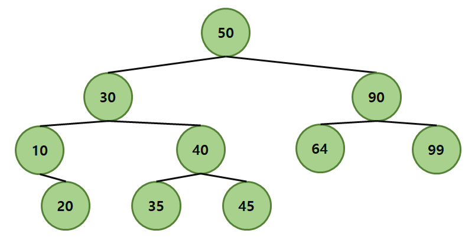

# ⚜5가지 이진탐색트리

</img>

  

#### 이 폴더에서는 이진탐색트리에 대해서 다룹니다. 그리고 여러 균형이진탐색트리 중 AVL tree / Red-Black tree / Splay tree / Treap에 대해 구현 및 설명합니다.

-------------------------------

## 목차
* [1. 저자](#1-저자)
* [2. 언어](#2-언어)
* [3. 소개](#3-소개)
* [4. 알고리즘 종류 및 아이디어](#4-알고리즘-종류-및-아이디어)
  * [4.1 BST](#41-BST)
  * [4.2 AVL Tree](#42-AVL-Tree)
  * [4.3 Red Black Tree](#43-Red-Black-Tree)
  * [4.4 Splay Tree](#44-Splay-Tree)
  * [4.5 Treap](#45-Treap)
* [5. 테스트 결과 및 분석](#5-테스트-결과-및-분석)
* [6. 결론](#6-결론)
* [7. 실행화면](#7-실행화면)

## 1. 저자
* #### 이한범  

## 2. 언어
* C++  

## 3. 소개
> Heap에서는 상/하에 따른 우선순위가 결정되었다. 좌/우에서의 우선순위가 절대적이지 않았고, 힙을 구성하고 전체적으로 힙을 재정비하는 시간에 O(nlgn)의 시간이 걸린다. 이와 달리, B.S.T에서는 왼쪽의 값이 오른쪽의 값보다 작다. 상/하에서의 값은 절대적이지 않고 평균적으로 탐색, 삽입/삭제에 O(lgN)이 걸린다. 따라서 어떤 자료구조의 형태가 더 낫다기 보다는 가장 작은 값 또는 큰 값을 추출할 때는 Heap, 탐색이 빈번하게 일어나는 경우에는 B.S.T가 사용된다.   
  
> 본 레포트에서는 이진탐색트리에 대해서 다룬다. 그리고 데이터가 sqewed하게 입력된 경우 worst-case가 발생하여 탐색에 O(N)이 되는 것을 방지하기 위해 구현된 여러 균형이진탐색트리. AVL tree, Red-Black tree, Splay tree, Treap을 조사 및 구현한다. 그리고 본 레포트에는 각각의 자료구조를 적용하였을 때, 데이터를 탐색하는 횟수 및 시간복잡도를 테스트를 통해 비교 분석하는 내용으로 구성된다.

## 4. 알고리즘 종류 및 아이디어
### 4.1 BST

### 4.2 AVL Tree

### 4.3 Red Black Tree

### 4.4 Splay Tree

### 4.5 Treap

## 5. 테스트 결과 및 분석

## 6. 결론
 
> 일단 탐색에 있어서 제일 좋은 성능을 보인 트리는 AVL Tree와 Red-Black Tree였다. 두 트리는 시간복잡도 O(lgN) 안쪽을 유지하며 다른 트리들에 비해 빠른 탐색 속도를 보여주었다. 그리고 AVL Tree의 경우 밸런스가 Red-Black Tree 보다 좀 더 엄격히 유지되어 미세한 차이로 빠른 것으로 보인다.  
  
> 하지만 노드 삽입 시의 관점은 조금 다르다. Red-Black Tree의 경우 enum방식의 color가 추가 되어 트리를 무조건 회전시키는 것이 아니라 색깔을 바꾸는 방법으로 수행된다. 따라서 삽입 시 balancing을 하는 과정에서 O(1)이 나올 수 있을 정도로 많은 시간을 필요로 하지 않는다. 반면, AVL Tree의 경우 노드를 삽입하면서 재귀적으로 balancing을 해주어 O(lgN)의 평균적인 시간복잡도를 가진다. 그러다 보니 프로그램을 돌렸을 때, AVL Tree에 노드를 삽입했을 때 다른 트리에 비해 시간이 오래 걸렸다.  
  
> ‘노드 삭제’를 구현하지는 않았지만 ‘삽입’과 비슷한 방식으로 수행되기 때문에 ‘삭제’ 또한 비슷한 양상일 것으로 보인다. 따라서 AVL Tree가 탐색에 있어서는 유리하지만 삽입, 삭제를 고려하면 Red-Black Tree가 제일 현실적으로 성능이 좋은 것으로 보인다.  
  
> 다음으로 좋은 성능을 보인 트리는 Treap과 B.S.T이다. Treap의 경우 각 노드들이 랜덤하게 우선순위를 가지고, heap의 성질을 가지고 있어 위의 두 트리보다는 탐색이 느리고, 다른 두 트리보다는 조금 더 나은 성능을 갖는 듯하다. 그리고 본 프로그램에서 데이터들이 랜덤하고 균등하게 생성된, 중복값이 없는 데이터들이다 보니 B.S.T의 경우 다른 트리들에 비해 성능이 그리 떨어지지 않는 결과가 나온 것으로 생각된다.  
  
> 마지막으로 본 프로그램에서 제일 안 좋은 성능을 갖는 트리는 바로 Splay Tree였다. 데이터들이 중복없이 균등하게 생성된 트리의 구조 속에서, Splay Tree의 ‘자주 탐색하는 key를 가진 노드를 루트에 가깝게 위치’하는 특성 때문에 중복값을 탐색할 일이 없다보니 제일 낮은 성능을 보이는 것으로 생각된다.  
  
> 평균적이고 랜덤한 데이터의 분포를 고려하였을 때, 위의 결과들이 일반적이라고 생각된다. 하지만 데이터들이 중복하여 생성되었거나, sqewed하게 배치되었다면 또 다른 결과가 나왔을 것이라 생각하였고, 이에 대한 내용은 추후 다른 알고리즘을 더 학습해나가며 알아볼 예정이다.  

## 7. 실행화면
